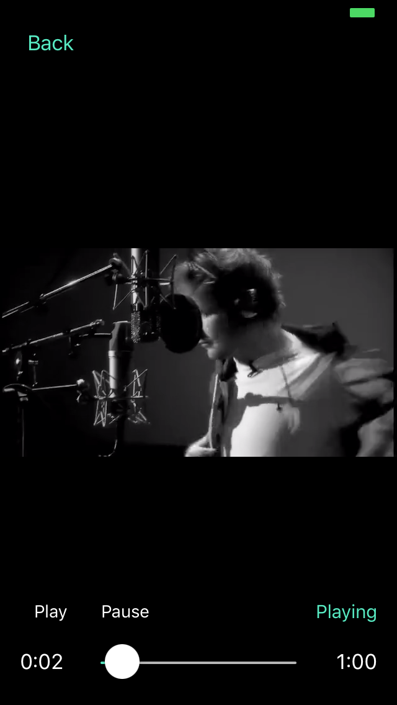
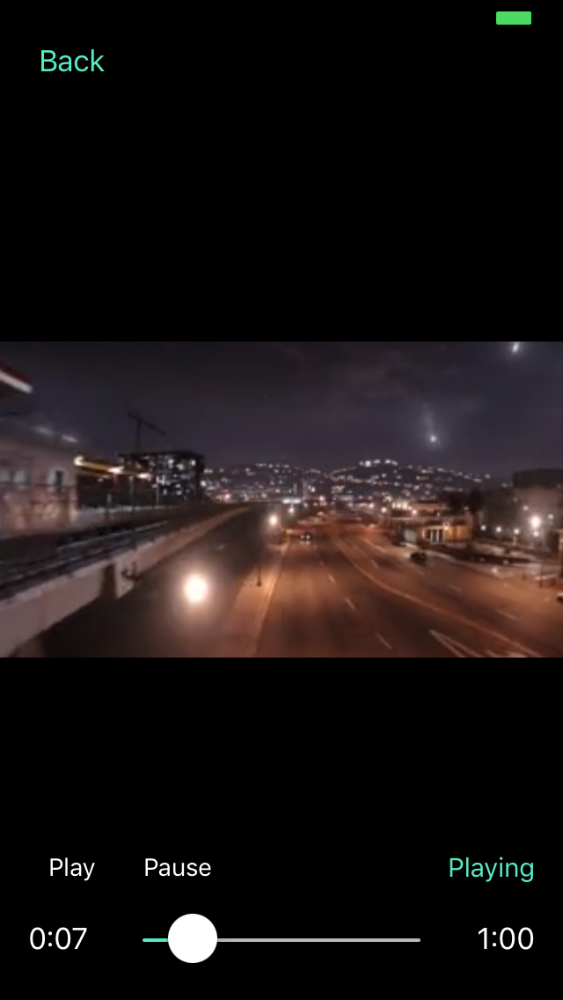
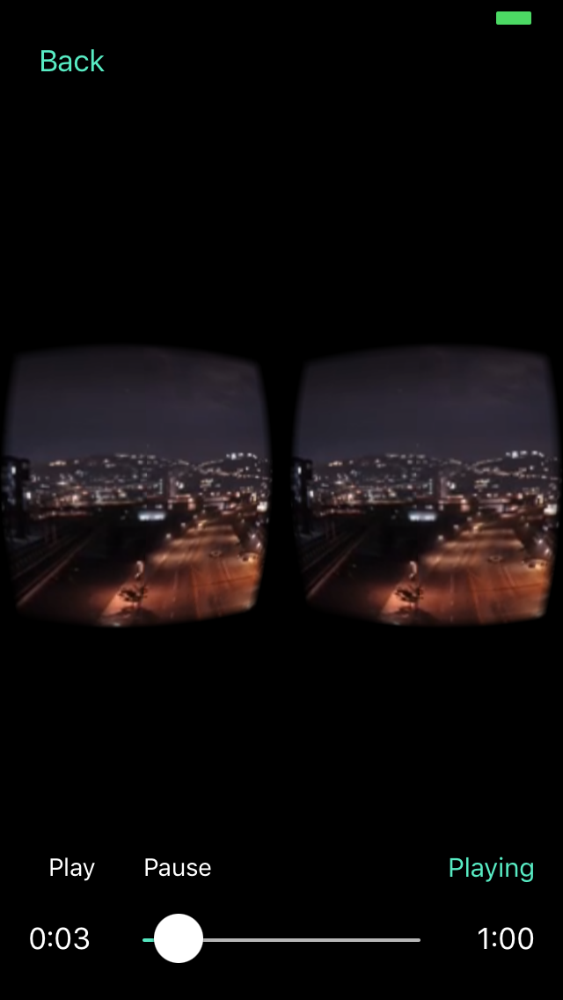
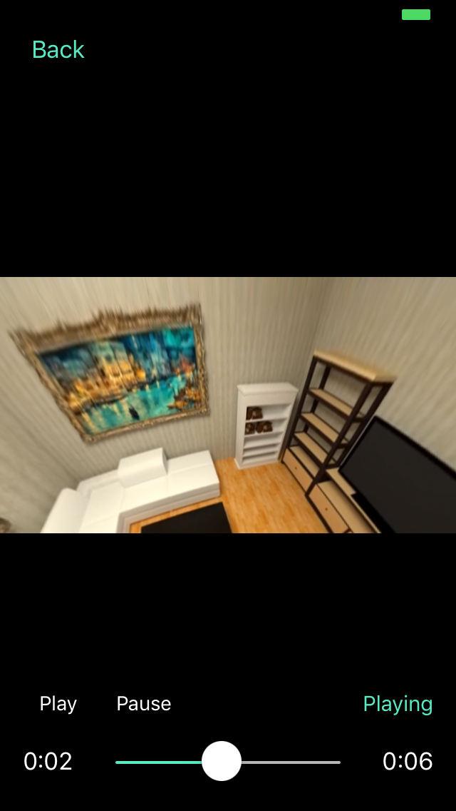
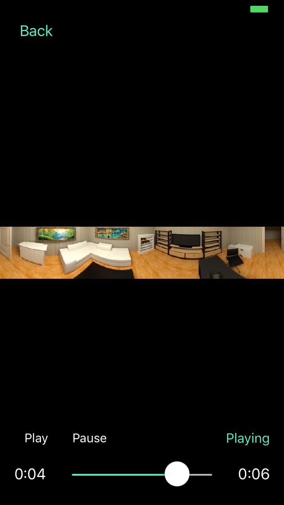
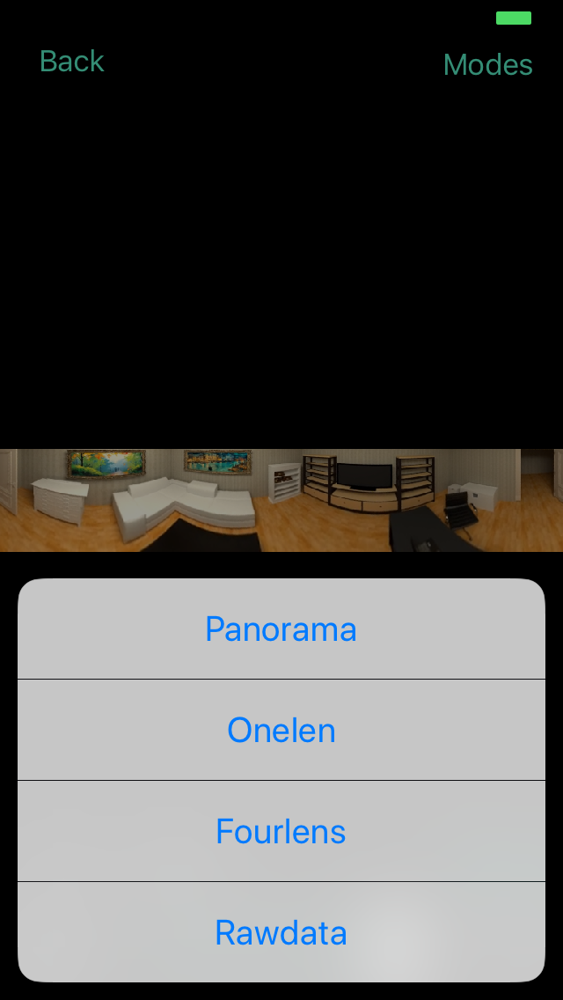
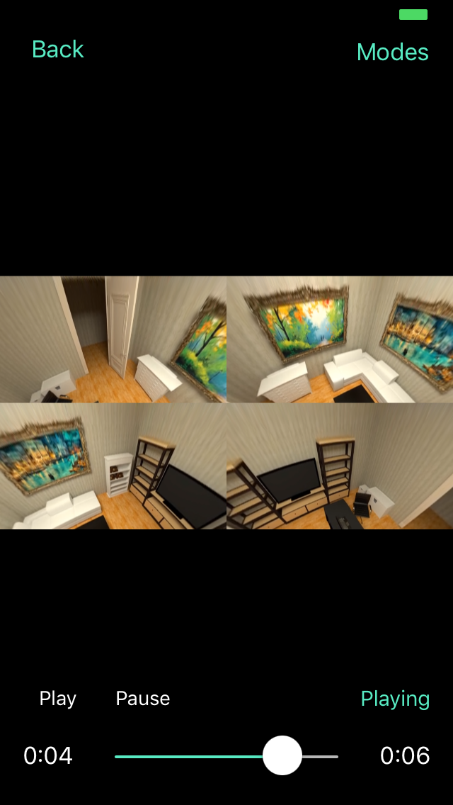

# IRPlayer

### IRPlayer is a powerful video player framework for iOS.

- Use IRPlayer to play video.
    - See demo.
- Use IRPlayer to make video player with custom UI.
    - See [IRPlayerUIShell](https://github.com/irons163/IRPlayerUIShell)
- Use IRPlayer to play IP Camera stream.
    - See [IRIPCamera](https://github.com/irons163/IRIPCamera)
- Use IRPlayer to make Screen Recoder.
    - See [IRRecoder](https://github.com/irons163/IRRecoder)
- Use IRPlayer to make RTMP streaming.
    - See [IRLiveKit](https://github.com/irons163/IRLiveKit)
- Use IRPlayer to make video player with effects .
    - See [IREffectPlayer](https://github.com/irons163/IREffectPlayer)
- Real Live player App.
    - See [IRLive](https://github.com/irons163/IRLive)

## Features

- Support Normal video mode.
- Support VR mode.
- Support VR Box mode.
- Support Fisheye mode.
    - Support Normal Fisheye mode.
    - Support Fisheye to Panorama mode.
    - Support Fisheye to Perspective mode.
- Support multi windows.
- Support multi modes selection.

## Install
### Cocoapods
- Add `pod 'IRPlayer', '~> 0.3.2'`  in the `Podfile`
- `pod install`

## Usage

- more examples in the demo applications.

### Basic

```obj-c

self.player = [IRPlayerImp player];
[self.mainView insertSubview:self.player.view atIndex:0];

NSURL * normalVideo = [NSURL fileURLWithPath:[[NSBundle mainBundle] pathForResource:@"i-see-fire" ofType:@"mp4"]];
NSURL * vrVideo = [NSURL fileURLWithPath:[[NSBundle mainBundle] pathForResource:@"google-help-vr" ofType:@"mp4"]];
NSURL * fisheyeVideo = [NSURL fileURLWithPath:[[NSBundle mainBundle] pathForResource:@"fisheye-demo" ofType:@"mp4"]];

```

#### Set mode and video source.

``` obj-c
switch (self.demoType)
{
    case DemoType_AVPlayer_Normal:
        [self.player replaceVideoWithURL:normalVideo];
        break;
    case DemoType_AVPlayer_VR:
        [self.player replaceVideoWithURL:vrVideo videoType:IRVideoTypeVR];
        break;
    case DemoType_AVPlayer_VR_Box:
        self.player.displayMode = IRDisplayModeBox;
        [self.player replaceVideoWithURL:vrVideo videoType:IRVideoTypeVR];
        break;
    case DemoType_FFmpeg_Normal:
        self.player.decoder.mpeg4Format = IRDecoderTypeFFmpeg;
        self.player.decoder.ffmpegHardwareDecoderEnable = NO;
        [self.player replaceVideoWithURL:normalVideo];
        break;
    case DemoType_FFmpeg_Normal_Hardware:
        self.player.decoder = [IRPlayerDecoder FFmpegDecoder];
        [self.player replaceVideoWithURL:normalVideo];
        break;
    case DemoType_FFmpeg_Fisheye_Hardware:
        self.player.decoder = [IRPlayerDecoder FFmpegDecoder];
        [self.player replaceVideoWithURL:fisheyeVideo videoType:IRVideoTypeFisheye];
        break;
    case DemoType_FFmpeg_Fisheye_Hardware_Modes_Selection:
        self.player.decoder = [IRPlayerDecoder FFmpegDecoder];
        [self.player replaceVideoWithURL:fisheyeVideo videoType:IRVideoTypeFisheye];
        break;
}

```

### Advanced settings
```obj-c

NSArray *modes = [self createFisheyeModesWithParameter:nil];
self.player.renderModes = modes;
[self.player replaceVideoWithURL:fisheyeVideo videoType:IRVideoTypeCustom];


- (NSArray<IRGLRenderMode*> *)createFisheyeModesWithParameter:(nullable IRMediaParameter *)parameter {
    IRGLRenderMode *normal = [[IRGLRenderMode2D alloc] init];
    IRGLRenderMode *fisheye2Pano = [[IRGLRenderMode2DFisheye2Pano alloc] init];
    IRGLRenderMode *fisheye = [[IRGLRenderMode3DFisheye alloc] init];
    IRGLRenderMode *fisheye4P = [[IRGLRenderModeMulti4P alloc] init];
    NSArray<IRGLRenderMode*>* modes = @[
    fisheye2Pano,
    fisheye,
    fisheye4P,
    normal
    ];

    normal.shiftController.enabled = NO;

    fisheye2Pano.contentMode = IRGLRenderContentModeScaleAspectFill;
    fisheye2Pano.wideDegreeX = 360;
    fisheye2Pano.wideDegreeY = 20;

    fisheye4P.parameter = fisheye.parameter = [[IRFisheyeParameter alloc] initWithWidth:0 height:0 up:NO rx:0 ry:0 cx:0 cy:0 latmax:80];
    fisheye4P.aspect = fisheye.aspect = 16.0 / 9.0;

    normal.name = @"Rawdata";
    fisheye2Pano.name = @"Panorama";
    fisheye.name = @"Onelen";
    fisheye4P.name = @"Fourlens";

    return modes;
}

```

## Screenshots
| Normal | VR |
|:---:|:---:|
|   |    |
| VR Box| Fisheye 360 |
|  |  |
| Panorama| Modes Selection |
|  |  |
| Multi Windows |  |
| |  |


## Copyright

##### This project has some basic codes from [SGPlayer](https://github.com/libobjc/SGPlayer).

Copyright for portions of project IRPlayer are held by Single, 2017. 
All other copyright for project IRPlayer are held by irons163, 2019.
